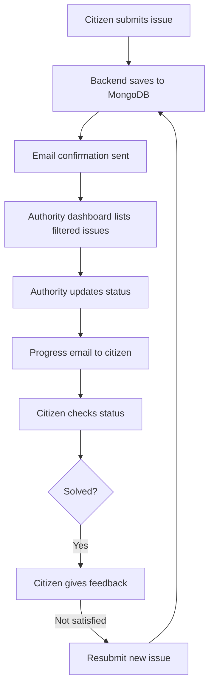

# Civic Issue Reporting

A full-stack civic issue reporting system with:

- Citizen App (Vite + React)
- Authority Dashboard (Vite + React)
- Node.js + Express backend
- MongoDB (Mongoose)
- Email notifications (Nodemailer)
- Map visualization (react-leaflet)

## Monorepo structure

```
SIH project/
  ├─ backend/
  ├─ citizen-app/
  └─ authority-dashboard/
```

## Dev setup

1. Start MongoDB locally (default port 27017)
2. Backend
   - cd backend
   - npm install
   - node index.js
3. Citizen app
   - cd citizen-app
   - npm install
   - npm run dev
4. Authority dashboard
   - cd authority-dashboard
   - npm install
   - npm run dev

Set VITE_API_BASE in citizen app if backend not on localhost.

## Notes
- File uploads stored under `backend/uploads/` and served at `/uploads`
- Department-based filtering enforced in the authority dashboard
- Citizen app lets you check issue status and give feedback when solved

### Maintenance
- Clear all issues in MongoDB (local): `npm run db:clear`

## Issue Lifecycle
See the full flow with Mermaid diagrams in `docs/issue-flow.md`.

Quick flowchart:


