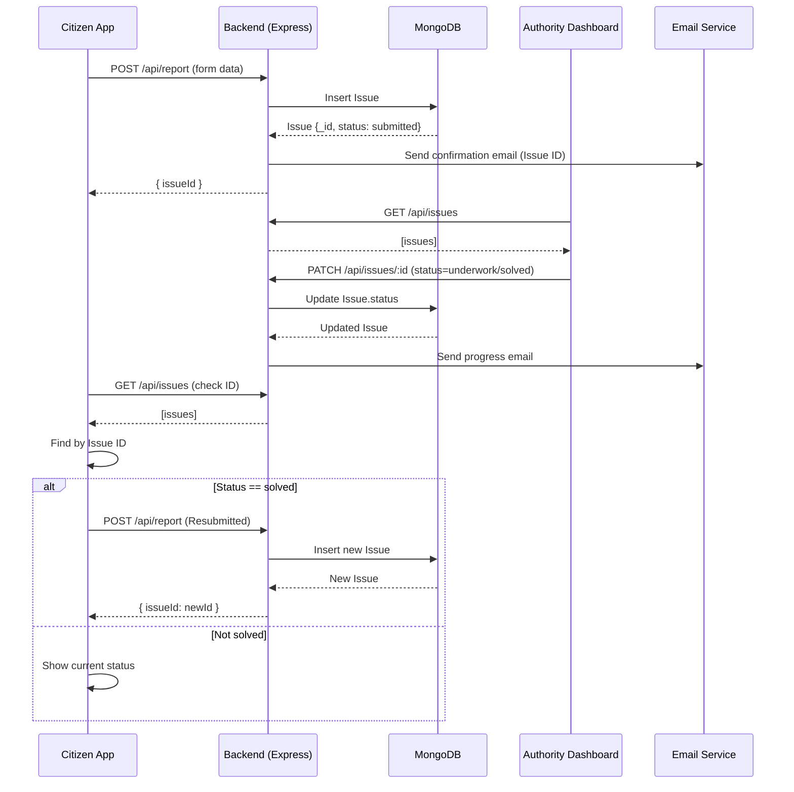

# Issue Lifecycle Flow

This diagram shows how a civic issue moves through the system from submission to resolution and citizen feedback.

## Flowchart

```mermaid
flowchart TD
    A[Citizen submits issue\n(description, category, dept, state, city, photo, email, location)]
    -->|POST /api/report| B{Backend (Express)}
    B --> C[Validate & save to MongoDB\n(Mongoose: Issue document)]
    C --> D[Send confirmation email\n(with Issue ID)]
    D --> E[Respond with { issueId }]
    E --> F[Citizen sees success + copies ID]

    subgraph Authority Dashboard
      G[Authority logs in\n(state, department)]
      H[Dashboard fetches issues]
      I[Filter by dept & state]
      J[Update status: submitted→underwork→solved]
    end

    F --> G
    H -->|GET /api/issues| B
    B --> H
    I --> J
    J -->|PATCH /api/issues/:id| B
    B --> K[Send progress email to citizen]

    subgraph Citizen Portal
      L[Check Issue tab\n(enter Issue ID)]
      M[Fetch issues & match by ID]
      N{Status solved?}
      O[Show Satisfied / Not satisfied]
      P[Resubmit issue\n(if not satisfied)]
    end

    F --> L
    L -->|GET /api/issues| B
    B --> M
    M --> N
    N -- No --> Q[Show current status]
    N -- Yes --> O
    O -- Not satisfied --> P
    P -->|POST /api/report| B
```

## Sequence Diagram



Notes:
- Authority Dashboard only sees issues matching the logged-in department and state.
- Citizen can resubmit if not satisfied after resolution; new issue gets a new ID.
- Emails are sent on submission and on status updates if citizen provided an email.
